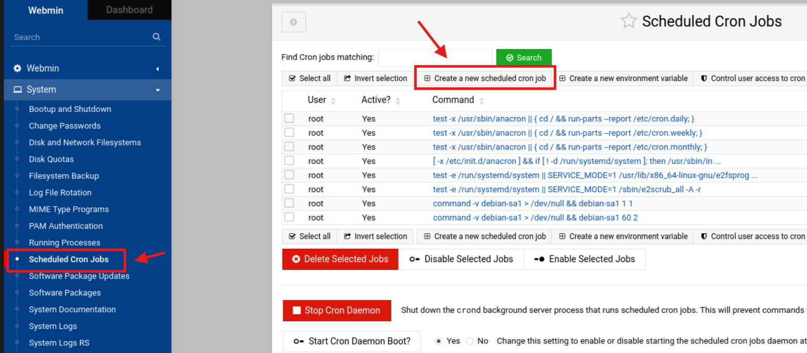

# WebminM4
Un repositori pel Mòdul 4 de SMX ; en colaboració amb el gran Dani Agache.

# Webmin


## Índex
 * [1.- Crear i modificar usuaris](#1)
 * [2.- Programar tasques](#2)
 * [3.- Instal·lació de software](#3)
 * [4.- Serveis](#4)
 * [5.- Quotes de disc](#5)
 * [6.- Còpies de seguretat](#6)
 * [7.- Compartició](#7)

<a id="1"></a>
## 1.- Crear i modificar usuaris

**Fer tot des de webmin**

- Has de crear dos usuaris bakalao_X i techno_X on (X és el vostre cognom).
  
  
  
  
- Els usuaris et passaran el hash de la seva contrasenya, no la contrasenya real. (podeu fer servir openssl).
  
  
  

- Cada usuari tindrà un directori a home igual al seu nom d'usuari.
  

- Utilitzaran bash com a shell. <br>
  Por la dreta a shell, seleccionar "bin/bash".
  
  

- Els usuaris estaran dins del grup que tingui el seu mateix nom i dins del grup usuaris_empresa.
  
  
  

- L'usuari techno no podrà fer login després del dia 31-03-2025.
  

- Comproveu que els usuaris poden iniciar sessió. <br>
  

- Canvia la data del sistema (utilitzant webmin) i comprova que techno no pot iniciar sessió si estem a dia 01-04-2025.
  
  
  

<a id="2"></a>
## 2.- Programar tasques

- Programa una tasca que neteja els paquets de Linux que ja no s'utilitzen una vegada al mes.
    
    
    
    
    
- Programa una tasca diaria que apaga l'ordinador a les 14:00.
    
    
    
- Comprova que funcionen (canvia dia i hora del sistema mitjançant webmin).
    
    
    
    
    
    
    
    
    
    

<a id="3"></a>
## 3.- Instal·lació de software

- Utilitza webmin per mostrar quins paquets de software es podrien actualitzar.
  

- Des de webmin actualitza un paquet.
  
  

- Utilitza webmin per instal·lar un joc de apt.
  
  
  
- Utilitza webmin per instal·lar gimp de apt.
  
  

- Utilitza webmin per desinatl·lar el joc que heu instal·lat abans.
  
  
  

<a id="4"></a>
## 4.- Serveis

- Utilitza webmin per mostrar els serveis que s'inicien amb el sistema.
    
    
    
- Utilitza webmin per mostrar els serveis que estan actius.
    
    
    
- Utilitza webmin per mostrar l'estat del servidor Apache.
    
    
    
- Utilitza webmin per aturar Apache.
    
    
    
- Utilitza webmin per mostrar l'estat del servidor Apache apagat.
    
    
    
- Utilitza webmin per reiniciar Apache.
    
    
    
- Utilitza webmin per mostrar l'estat del servidor Apache reiniciat.
    
    

<a id="5"></a>
## 5.- Quotes de disc

Activa les quotes de disc pels usuaris amb la comanda: 

```
sudo apt install quota quotatool
```


- Utilitza webmin perquè l'usuari bakalao_X no pugui tenir més de 2 MB d'informació al disc.
  
  
  

- Comprova que el límit de la quota funciona.
  
  
- Utilitza webmin perquè l'usuari techno no pugui tenir més de 10 fitxers al disc.
  

- Comprova que el límit de la quota funciona.
  

<a id="6"></a>
## 6.- Còpies de seguretat

- Utilitzant el mòdul de Webmin Filesystem Backup fes una còpia de seguretat del directori /home al directori /backups (l'haureu de crear si no existeix).
    
    
    
    
    
    
    
    
    
- Modifica alguns fitxers de /home.
    
    
    
- Recupera la còpia de seguretat.
    
    
    
    
    
    
    
    
    
- Comprova que els fitxers de /home són els correctes.
    
    
    
- Programa una còpia de seguretat de /home/bakalao_X per els divendres a les 21 :00.
    
    
    
    
    
- Esborra la còpia de seguretat programada anteriorment.
    
    

<a id="7"></a>
## 7.- Compartició
- Primer pas, convertir als usuaris a usuaris de Samba.
  
  

- Crea un recurs a webmin que, utilitzant samba, comparteixi una carpeta anomenada "area_public_X" per a usuaris sense autenticar en forma de lectura i escriptura.
  
  
  
  

- Crea un recurs a webmin que, utilitzant samba, comparteixi una carpeta anomenada "pontaeri_privat_X" per a usuaris _X i techno només de lectura. <br>
  
  
  
  
  

- Comprovar des de Windows que aquests recursos funcionen. <br>
  #### Area Public:
  
  

  #### Pontaeri Privat: <br>
  Sessió com bakalao:
  

  Sessió com techno:
  


# Grups:

1. Kristopher i Eric
2. Oscar i Nil
3. Oriol i Ayoub
### 4. Arno i Daniel
5. Sebastian i Biel
